# 2025's Top 12 Best AI Copywriting Tools

Writing marketing copy used to mean staring at blank screens until inspiration struck—or worse, until the deadline forced something out. Now AI copywriting platforms generate dozens of variations in seconds, letting you pick winners instead of wrestling with writer's block. The real challenge isn't finding tools that write, it's finding ones that write copy people actually click, read, and act on. Performance prediction, brand voice customization, and real-time optimization separate platforms that just spit out words from ones that genuinely improve conversion rates.

## **[Anyword](https://www.anyword.com)**

Performance-driven AI copywriting with predictive scoring for marketing teams obsessed with conversion data.

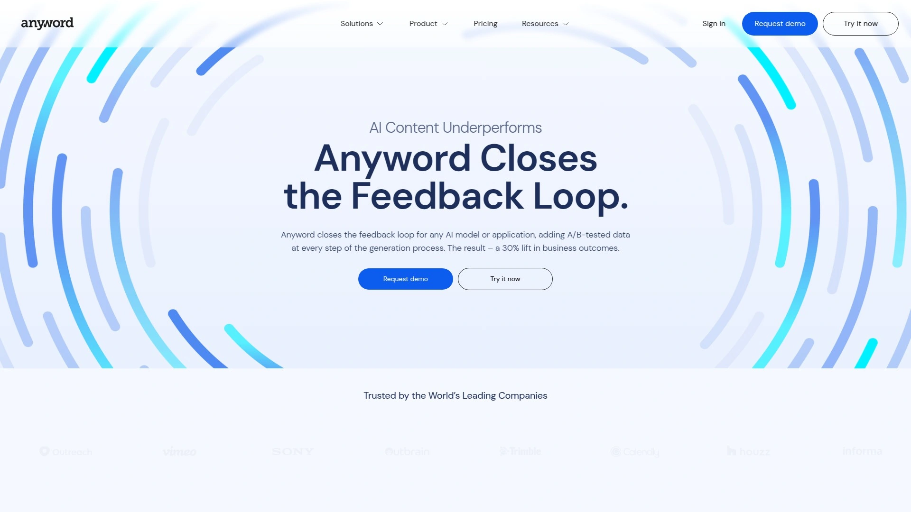

Anyword positions itself as the copywriting platform that closes the feedback loop between content creation and actual performance. The platform analyzes A/B-tested data at every generation step, delivering measurable lifts—users report 30% improvements in business results on average. Unlike generic AI writers, Anyword treats each piece of copy as part of a larger performance ecosystem.

The predictive performance score appears before you publish anything, rating each variation based on historical data from similar campaigns. You can customize generation through Customer Personas, letting the AI understand who you're writing for and adjust language accordingly. Power Mode takes this further by learning your specific writing style, creating copy that sounds like it came from your keyboard rather than a machine.

Anyword handles everything from ad copy and social posts to emails, landing pages, and full blog articles. The "Create Your Own Use Case" feature means you're not locked into predefined templates—need a product review, newsletter intro, or short biography? Just describe it and the platform adapts. Integration with major ad platforms pulls your existing high-performing copy to create custom writing modes that mirror your best work.

The platform scans historical copy, analyzes keywords (including emojis and hashtags), and builds text around them that actually makes contextual sense. Brand voice training happens through connected ad accounts or manual input, letting teams maintain consistency across channels without writing style guides. Real-time analytics show CTR, impressions, and engagement metrics for connected accounts, so you're optimizing based on data rather than guesswork.

Teams using Anyword appreciate how it works with any AI model or application, adding tested data layers to whatever generation system you're already running. The plagiarism checker on Blog Wizard ensures originality, while the rewrite feature transforms existing content into fresh variations. Demographic insights accompany each generated variant, helping you understand which audiences respond to different messaging approaches.

## **[Jasper](https://www.jasper.ai)**

AI marketing platform with 50-plus copywriting skills and team collaboration for enterprise content velocity.

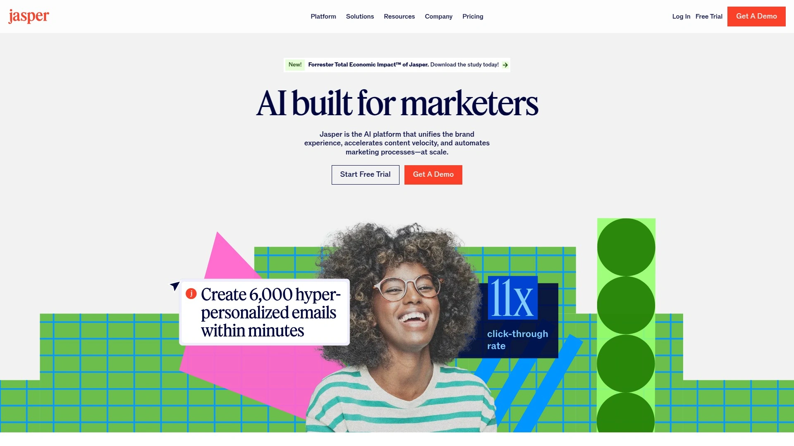

Jasper trains AI on over 50 specific copywriting skills, covering everything from high-converting ads to engaging landing pages. The platform enables marketers across functions to accelerate adoption through pre-built apps fine-tuned for marketing use cases. World-class teams at companies like Exit-Five trust Jasper for consistent content production.

The one-click improvement feature lets you highlight text and instantly adjust writing quality, tone, length, or repurpose content for different channels. Brand Voice functionality analyzes your existing content's tone, then applies formatting rules so generated writing always sounds authentic. Document sharing between team members includes status labels for quick review workflows.

Jasper's user-friendly document editor handles all formatting internally, eliminating copy-paste friction between platforms. The AI writing assistant helps copywriters, marketers, and entrepreneurs create professional copy matching brand identity in seconds. Templates cover product descriptions, social media captions, blog outlines, and full-length articles—just input simple directions about subject matter and tone.

Pricing starts at $59 monthly for Professional Plans, with customized Business plans available for teams exceeding five users. The seven-day free trial lets you test capabilities before committing. Integration with Surfer SEO adds content optimization directly into the writing workflow.

## **[Copy.ai](https://www.copy.ai)**

Go-to-market AI platform unifying data, connecting teams, and automating sales and marketing workflows.

Copy.ai evolved beyond simple writing tools into a comprehensive GTM platform acting as a strategic command center. The system infuses AI across entire go-to-market engines, streamlining content creation, prospecting, lead processing, and deal forecasting. This approach unifies data, connects teams, and eliminates bloat from marketing technology stacks.

Chat functions as an AI assistant for brainstorming ideas, creating copy, blog outlines, and producing complete pieces like long-form content, ad copy, and product descriptions. Teams switch between multiple chat models including GPT 3.5, GPT 4, Azure, and Claude to accommodate individual writing processes. Infobase stores all brand information—voice, image, and necessary details—familiarizing the AI with representation preferences for consistent output.

Brand Voice analyzes original content to understand your style, then generates copy accordingly. Review insights and tweak marketing copy directly on the platform, maintaining consistent brand presence across channels. Agentic Actions automate targeted tasks using AI-driven agents that make adaptive decisions within defined guardrails, ensuring alignment with brand voice and strategy.

Platform integrations connect with CRMs and 2,000-plus applications through Zapier, unlocking unprecedented automation levels. SOC 2 Type 2 compliance provides enterprise-grade security with robust encryption and strict access controls. The platform helps entire GTM teams create compelling, on-brand content at scale while codifying best practices for execution precision.

## **[Writesonic](https://writesonic.com/)**

Fast article generation with SEO integration and instant writing modes for e-commerce and social content.

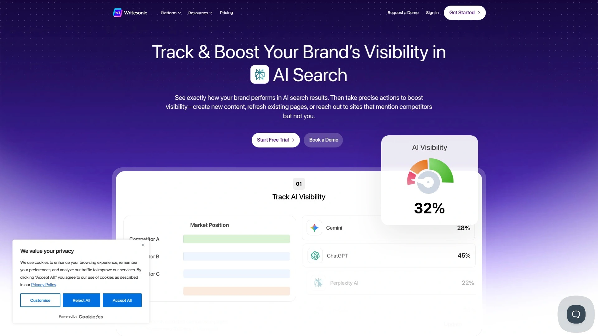

Writesonic's Article Writer 4.0 generates high-quality, SEO-friendly content through integrated keyword research tools showing volume, traffic estimates, and difficulty scores. The four-step blog generation process is customizable at every stage, producing 2,000-plus word articles optimized for search rankings. Instant Article Writer creates complete pieces immediately by adding topic ideas.

The Sonic Editor provides three modes—Focus, Sonic, and Surfer—leading to increased productivity and effective copywriting. You can bring AI-generated text from any template into the editor for further refinement. Built-in plagiarism checkers ensure 100% original content before publishing. The platform handles everything from blog titles and outlines to complete articles, generating catchy Instagram captions, engaging tweets, and end-to-end YouTube content.

Text generator AI creates Facebook ad copy, emails, product descriptions, and social media posts 10 times faster than manual writing. Natural Language Processing produces texts that are informative and engaging simultaneously. Free tool access requires no sign-up, lowering barriers for quick content needs.

## **[Rytr](https://rytr.me)**

Budget-friendly AI writer supporting 30-plus languages with 40-plus use cases and free tier access.

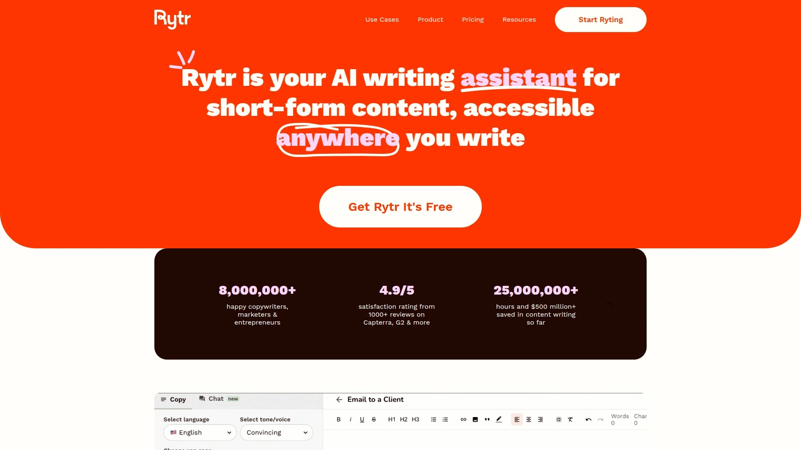

Rytr offers AI writing assistance trusted by over seven million content writers, entrepreneurs, and marketers at companies including Dell, IKEA, and Ford. The platform supports over 30 languages from English and Spanish to Chinese, Arabic, Danish, and Japanese, expanding content reach globally. Over 20 tone options let you match specific needs—urgent for flash sales, appreciative for reviews, authoritative for blog posts.

Document management organizes writing projects into folders with intuitive navigation and creation tools. The rich text editor enables collaboration with AI to produce tailored content. Over 40 pre-set use cases cover blog ideas, outlines, email copy, product descriptions, video descriptions, and even poem generation. Paid plans unlock custom use case design.

The AI writer lets you input primary keywords, select variant numbers, and choose creativity levels before generation. Text improvement tools expand, shorten, or reword existing work. SERP analysis, image generation, and plagiarism checking add value beyond basic writing. The platform maintains a free tier, making it accessible for testing before upgrading to unlimited plans.

## **[Grammarly](https://www.grammarly.com)**

AI writing assistant with real-time suggestions across 500,000-plus apps for clarity and professionalism.

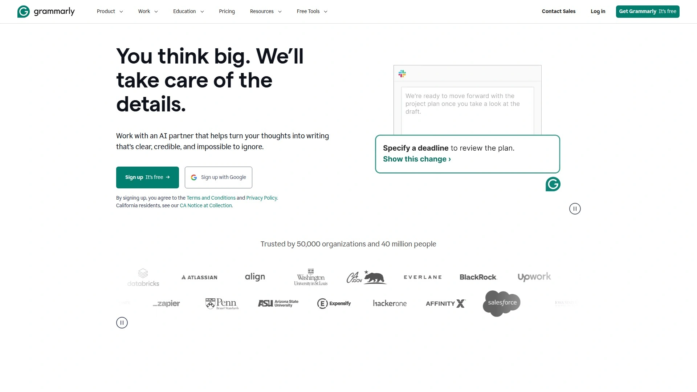

Grammarly works everywhere you write—across 500,000-plus apps and websites—offering real-time feedback without copying and pasting. The AI writing assistant unblocks ideas and maintains steady flow states through simple prompting for emails, reports, articles, and more. Rewrite features adjust tone, length, and formality so you communicate effectively to anyone about anything.

Writing suggestions sound authentic because you can personalize Grammarly to match your voice. The platform tackles blank pages by getting ideas onto screens quickly, then organizing and developing them into flawless, coherent writing. Email replies accelerate when you can summarize messages and respond using context-specific prompts. Brand tone configuration lets entire teams generate consistent, on-brand writing instantly.

Advanced features include sentence rewrites improving clarity, flow, and engagement. Tone, formality, and word choice enhancements adapt content to academic, technical, or professional contexts. Audience insights guide message reception. AI content detection and plagiarism checks ensure originality while supporting faster writing and sharper communication across all online locations.

## **[Surfer SEO](https://surferseo.com)**

Content optimization platform analyzing 500-plus ranking factors with real-time scoring and outline building.

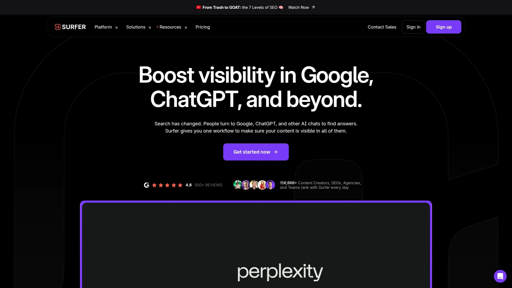

Surfer's Content Editor makes creating content that reads well and ranks high straightforward regardless of industry, language, or location. Content Score provides real-time responsive metrics showing optimization progress through analysis of 500-plus ranking factors including keyword optimization, entity extraction, link equity, content relevance, topic coverage, and topical authority.

Powerful integrations with Google Docs, ChatGPT, WordPress, and Contentful mean Surfer works where you work—less friction, more ease, better results. The built-in Outline Builder structures content into detailed outlines with unique potential headings and questions in seconds. Real-time metrics track structure, word count, NLP-ready keywords, and images while writing and optimizing simultaneously in any language.

Surfy acts as a personal writing assistant helping edit, rephrase, and refine articles in real-time. Custom Voice lets you write in unique tones and styles while keeping content SEO-friendly and polished. Topics feature maps relevant ideas and gaps straight from top competitors, ensuring your content stands out as authoritative for readers and search engines alike.

## **[Frase](https://frase.io)**

SEO and GEO optimization platform targeting both Google rankings and AI platform citations.

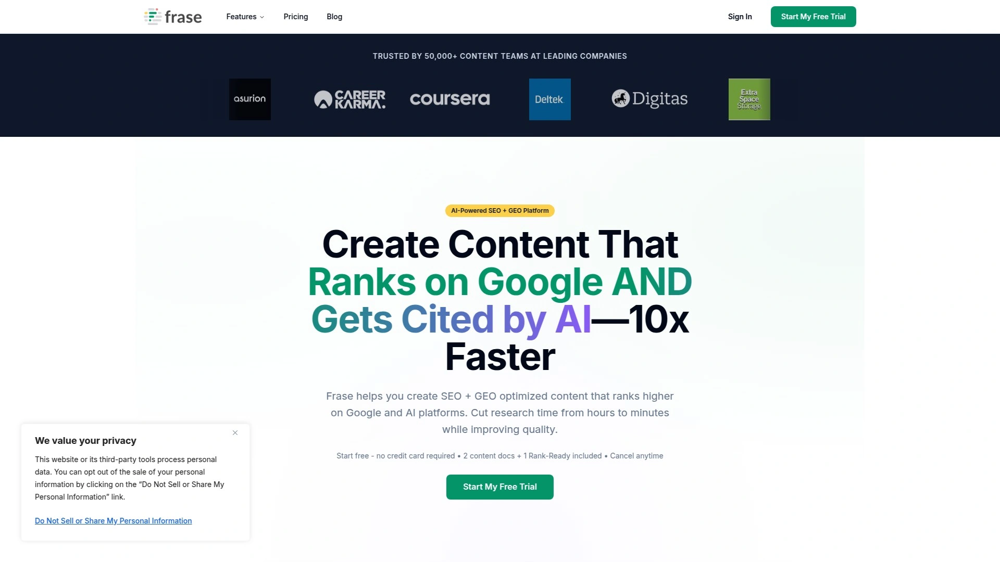

Frase guides you through research, writing, and optimization for Google and AI platforms in five steps. The system analyzes top 20 search results to understand what's ranking, identifying topics, questions, and content patterns from competitors. SERP research shows exactly what to cover for ranking success.

Extracted questions boost citation chances on ChatGPT, Perplexity, Claude, and Gemini—AI platforms prioritize content providing direct answers to user queries. AI-generated outlines ensure comprehensive topic coverage for both traditional search and generative AI platforms, including headings, subheadings, and suggested structures.

Dual scoring systems track combined optimization performance with separate SEO scores for Google and GEO scores for AI platforms in real-time. Specific suggestions improve both dimensions through topic coverage, readability improvements, structure recommendations, and AI-friendly formatting—all updated as you write. The platform helps content get discovered and understood wherever and however people search.

## **[Scalenut](https://www.scalenut.com)**

AI-powered SEO suite creating and optimizing content for search and AI systems in five minutes.

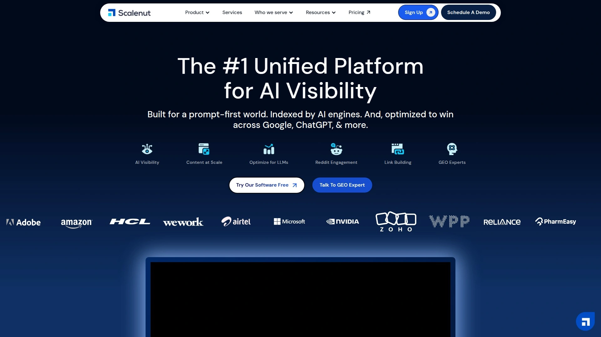

Scalenut's Content Optimizer analyzes top-ranking URLs and generates Content Scores evaluating how well your content optimizes for search engines and AI systems. You can benchmark against the top 10, 20, or 30 ranking pages for tailored competitive analysis. Primary and secondary keyword input along with target audience location customizes optimization recommendations.

The platform identifies keyword gaps, tracks in-progress terms, marks completed optimizations, and flags overused phrases. Real-time metrics guide improvements during writing rather than after publication. Integration with content management systems like WordPress simplifies publishing processes directly from the platform.

SEO and content suite features include keyword optimization, on-page element enhancement, and meta description refinement. The platform positions itself as a tool for creating winning content that AI picks, compressing typical workflows into minutes rather than hours. Built-in tools ensure content quality meets modern standards for both traditional and AI-driven search.

## **[QuillBot](https://quillbot.com)**

AI paraphrasing and grammar tool with multiple rewriting modes for professional polish.

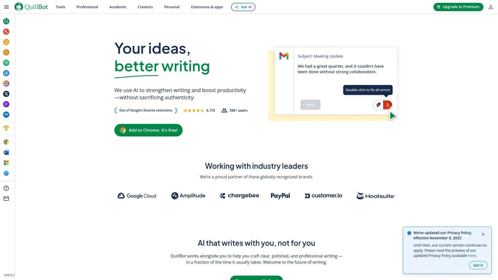

QuillBot offers AI-powered paraphrasing that elevates writing through various modes suitable for business communication. Formal Mode keeps communications polished and professional, while Custom Mode matches brand voice style and tone. The platform instantly fixes grammar, spelling, and punctuation errors while refining awkward phrasing in client-facing documents.

Unlimited paraphrasing in premium plans unlocks 11-plus modes including Formal, Custom, and specialized options. Advanced grammar and sentence-level edits improve clarity and flow without changing your professional voice. Tone, clarity, and readability insights help tailor language for different formats—executive summaries, in-depth analyses, and team correspondence.

The Chrome extension provides real-time assistance across 500,000-plus websites without switching tools or tabs. Multilanguage support covers English, Spanish, French, German, Portuguese, and Dutch. Free plans include Standard and Fluency modes with basic grammar checking, while premium unlocks comprehensive tooling from rephrasing to detailed tone insights.

## **[Hemingway Editor](https://hemingwayapp.com)**

Minimalist editing tool highlighting sentence complexity and readability issues through color coding.

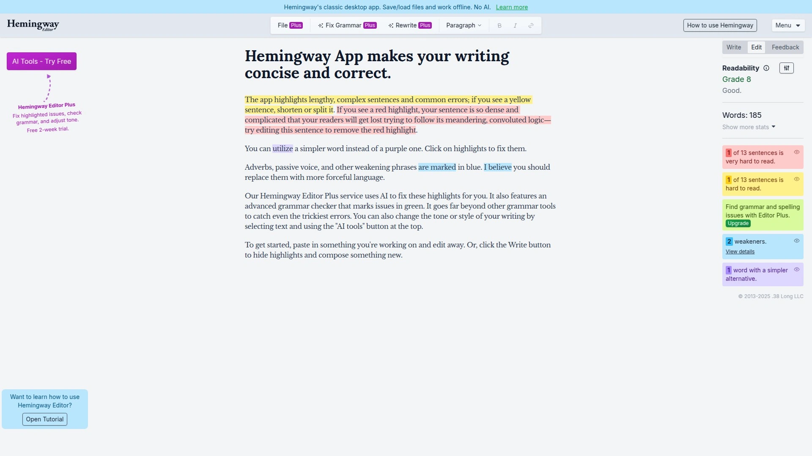

Hemingway Editor identifies errors and improvement areas through color-coded highlighting of common mistakes and sentence structure issues. The tool finds and fixes problems in spelling, syntax, flow, and sentence structure, making writing bold and clear. Named after Ernest Hemingway, it embodies his philosophy that complex writing benefits from simplification.

The desktop version requires no internet connection, working offline on any device with formatting and direct publishing features. Color-coded blocks let you identify and review suggested improvements at a glance—hover over highlighted portions to see instant revision options. The tool emphasizes readability scores and flags hard-to-read sentences, passive voice, and adverb overuse.

Free online editing requires no account—just visit the website and start writing or paste existing text. The downloadable app involves a one-off payment for permanent access. While the tool provides suggestions, your writer's intuition makes final decisions about what to change or keep, maintaining authentic voice while improving clarity.

## **[Copysmith](https://copysmith.ai)**

E-commerce-focused content suite with bulk generation and product description specialization.

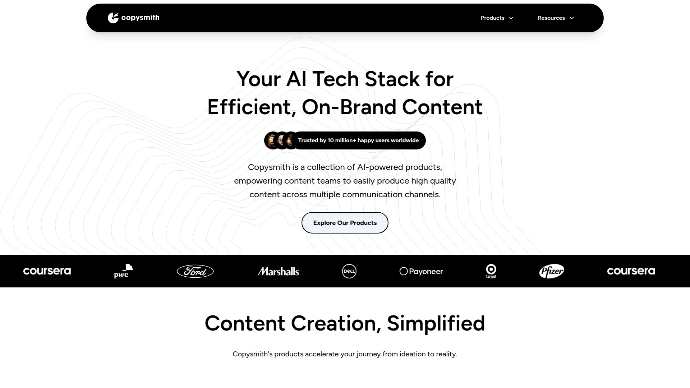

Copysmith evolved into a specialized suite serving content teams with particular strength in e-commerce. Describely sits at the heart of their e-commerce offering, purpose-built for generating and managing product content including descriptions, titles, and metadata. Key strengths include bulk content generation and enriching existing product data, solving massive pain points for online retailers with large catalogs.

Rytr acquisition added versatile, general-purpose content generation within the ecosystem, supporting 35-plus languages and 40-plus content types. The platform handles emails, social media posts, and creative writing prompts, making it flexible for diverse marketing needs. Frase integration brings powerful SEO capabilities for content research, writing, and optimization.

Automated content creation software helps teams work smarter rather than harder. The collection of AI-powered products reflects a deliberate strategic shift from general AI copywriting to specialized tools designed for specific high-value needs. This modular approach lets users leverage functionalities often more powerful than generalized platform features.

## FAQ

**Which AI copywriting tool actually predicts conversion performance before publishing?**
Anyword specializes in predictive performance scoring, analyzing A/B-tested data to rate each copy variation before it goes live. The platform shows which variations will likely perform best based on historical campaign data, helping teams choose winners instead of guessing. This closes the feedback loop between content creation and measurable business results.

**Can AI copywriting tools really match brand voice consistently across campaigns?**
Several platforms tackle this challenge—Anyword trains on your historical copy and connected ad accounts to mirror your style, while Jasper analyzes existing content tone to apply formatting rules automatically. Copy.ai's Brand Voice feature and Grammarly's customization options let you configure AI output to sound authentic. The key is feeding the platform enough examples of your actual writing to learn from.

**How do SEO-focused AI writers differ from general copywriting platforms?**
SEO-focused tools like Surfer SEO and Frase analyze top-ranking pages to provide real-time optimization scores based on 500-plus ranking factors, while general copywriting platforms focus on generating compelling text without search ranking considerations. Scalenut and ContentShake AI bridge both worlds by combining content generation with built-in SEO recommendations. Choose based on whether you need search visibility or just persuasive copy.

## Conclusion

The AI copywriting landscape split into two camps—tools that generate words quickly versus platforms that generate words that actually convert. [Anyword](https://www.anyword.com) stands apart for marketing teams who refuse to publish copy without knowing how it'll perform, using predictive scoring based on A/B-tested data to show expected results before anything goes live. When conversion rates and business metrics matter more than just filling content calendars, the 30% performance lifts and integration with existing ad accounts make it worth testing for teams serious about data-driven marketing copy.

[84](https://www.alexbirkett.com/surfer-seo-review/)# 2025's Top 12 Best AI Copywriting Tools

Writing marketing copy used to mean staring at blank screens until inspiration struck—or worse, until the deadline forced something out. Now AI copywriting platforms generate dozens of variations in seconds, letting you pick winners instead of wrestling with writer's block. The real challenge isn't finding tools that write, it's finding ones that write copy people actually click, read, and act on. Performance prediction, brand voice customization, and real-time optimization separate platforms that just spit out words from ones that genuinely improve conversion rates.

## **[Anyword](https://www.anyword.com)**

Performance-driven AI copywriting with predictive scoring for marketing teams obsessed with conversion data.

Anyword positions itself as the copywriting platform that closes the feedback loop between content creation and actual performance. The platform analyzes A/B-tested data at every generation step, delivering measurable lifts—users report 30% improvements in business results on average. Unlike generic AI writers, Anyword treats each piece of copy as part of a larger performance ecosystem.

The predictive performance score appears before you publish anything, rating each variation based on historical data from similar campaigns. You can customize generation through Customer Personas, letting the AI understand who you're writing for and adjust language accordingly. Power Mode takes this further by learning your specific writing style, creating copy that sounds like it came from your keyboard rather than a machine.

Anyword handles everything from ad copy and social posts to emails, landing pages, and full blog articles. The "Create Your Own Use Case" feature means you're not locked into predefined templates—need a product review, newsletter intro, or short biography? Just describe it and the platform adapts. Integration with major ad platforms pulls your existing high-performing copy to create custom writing modes that mirror your best work.

The platform scans historical copy, analyzes keywords (including emojis and hashtags), and builds text around them that actually makes contextual sense. Brand voice training happens through connected ad accounts or manual input, letting teams maintain consistency across channels without writing style guides. Real-time analytics show CTR, impressions, and engagement metrics for connected accounts, so you're optimizing based on data rather than guesswork.

Teams using Anyword appreciate how it works with any AI model or application, adding tested data layers to whatever generation system you're already running. The plagiarism checker on Blog Wizard ensures originality, while the rewrite feature transforms existing content into fresh variations. Demographic insights accompany each generated variant, helping you understand which audiences respond to different messaging approaches.

## **[Jasper](https://www.jasper.ai)**

AI marketing platform with 50-plus copywriting skills and team collaboration for enterprise content velocity.

Jasper trains AI on over 50 specific copywriting skills, covering everything from high-converting ads to engaging landing pages. The platform enables marketers across functions to accelerate adoption through pre-built apps fine-tuned for marketing use cases. World-class teams at companies like Exit-Five trust Jasper for consistent content production.

The one-click improvement feature lets you highlight text and instantly adjust writing quality, tone, length, or repurpose content for different channels. Brand Voice functionality analyzes your existing content's tone, then applies formatting rules so generated writing always sounds authentic. Document sharing between team members includes status labels for quick review workflows.

Jasper's user-friendly document editor handles all formatting internally, eliminating copy-paste friction between platforms. The AI writing assistant helps copywriters, marketers, and entrepreneurs create professional copy matching brand identity in seconds. Templates cover product descriptions, social media captions, blog outlines, and full-length articles—just input simple directions about subject matter and tone.

Pricing starts at $59 monthly for Professional Plans, with customized Business plans available for teams exceeding five users. The seven-day free trial lets you test capabilities before committing. Integration with Surfer SEO adds content optimization directly into the writing workflow.

## **[Copy.ai](https://www.copy.ai)**

Go-to-market AI platform unifying data, connecting teams, and automating sales and marketing workflows.

Copy.ai evolved beyond simple writing tools into a comprehensive GTM platform acting as a strategic command center. The system infuses AI across entire go-to-market engines, streamlining content creation, prospecting, lead processing, and deal forecasting. This approach unifies data, connects teams, and eliminates bloat from marketing technology stacks.

Chat functions as an AI assistant for brainstorming ideas, creating copy, blog outlines, and producing complete pieces like long-form content, ad copy, and product descriptions. Teams switch between multiple chat models including GPT 3.5, GPT 4, Azure, and Claude to accommodate individual writing processes. Infobase stores all brand information—voice, image, and necessary details—familiarizing the AI with representation preferences for consistent output.

Brand Voice analyzes original content to understand your style, then generates copy accordingly. Review insights and tweak marketing copy directly on the platform, maintaining consistent brand presence across channels. Agentic Actions automate targeted tasks using AI-driven agents that make adaptive decisions within defined guardrails, ensuring alignment with brand voice and strategy.

Platform integrations connect with CRMs and 2,000-plus applications through Zapier, unlocking unprecedented automation levels. SOC 2 Type 2 compliance provides enterprise-grade security with robust encryption and strict access controls. The platform helps entire GTM teams create compelling, on-brand content at scale while codifying best practices for execution precision.

## **[Writesonic](https://writesonic.com/)**

Fast article generation with SEO integration and instant writing modes for e-commerce and social content.

Writesonic's Article Writer 4.0 generates high-quality, SEO-friendly content through integrated keyword research tools showing volume, traffic estimates, and difficulty scores. The four-step blog generation process is customizable at every stage, producing 2,000-plus word articles optimized for search rankings. Instant Article Writer creates complete pieces immediately by adding topic ideas.

The Sonic Editor provides three modes—Focus, Sonic, and Surfer—leading to increased productivity and effective copywriting. You can bring AI-generated text from any template into the editor for further refinement. Built-in plagiarism checkers ensure 100% original content before publishing. The platform handles everything from blog titles and outlines to complete articles, generating catchy Instagram captions, engaging tweets, and end-to-end YouTube content.

Text generator AI creates Facebook ad copy, emails, product descriptions, and social media posts 10 times faster than manual writing. Natural Language Processing produces texts that are informative and engaging simultaneously. Free tool access requires no sign-up, lowering barriers for quick content needs.

## **[Rytr](https://rytr.me)**

Budget-friendly AI writer supporting 30-plus languages with 40-plus use cases and free tier access.

Rytr offers AI writing assistance trusted by over seven million content writers, entrepreneurs, and marketers at companies including Dell, IKEA, and Ford. The platform supports over 30 languages from English and Spanish to Chinese, Arabic, Danish, and Japanese, expanding content reach globally. Over 20 tone options let you match specific needs—urgent for flash sales, appreciative for reviews, authoritative for blog posts.

Document management organizes writing projects into folders with intuitive navigation and creation tools. The rich text editor enables collaboration with AI to produce tailored content. Over 40 pre-set use cases cover blog ideas, outlines, email copy, product descriptions, video descriptions, and even poem generation. Paid plans unlock custom use case design.

The AI writer lets you input primary keywords, select variant numbers, and choose creativity levels before generation. Text improvement tools expand, shorten, or reword existing work. SERP analysis, image generation, and plagiarism checking add value beyond basic writing. The platform maintains a free tier, making it accessible for testing before upgrading to unlimited plans.

## **[Grammarly](https://www.grammarly.com)**

AI writing assistant with real-time suggestions across 500,000-plus apps for clarity and professionalism.

Grammarly works everywhere you write—across 500,000-plus apps and websites—offering real-time feedback without copying and pasting. The AI writing assistant unblocks ideas and maintains steady flow states through simple prompting for emails, reports, articles, and more. Rewrite features adjust tone, length, and formality so you communicate effectively to anyone about anything.

Writing suggestions sound authentic because you can personalize Grammarly to match your voice. The platform tackles blank pages by getting ideas onto screens quickly, then organizing and developing them into flawless, coherent writing. Email replies accelerate when you can summarize messages and respond using context-specific prompts. Brand tone configuration lets entire teams generate consistent, on-brand writing instantly.

Advanced features include sentence rewrites improving clarity, flow, and engagement. Tone, formality, and word choice enhancements adapt content to academic, technical, or professional contexts. Audience insights guide message reception. AI content detection and plagiarism checks ensure originality while supporting faster writing and sharper communication across all online locations.

## **[Surfer SEO](https://surferseo.com)**

Content optimization platform analyzing 500-plus ranking factors with real-time scoring and outline building.

Surfer's Content Editor makes creating content that reads well and ranks high straightforward regardless of industry, language, or location. Content Score provides real-time responsive metrics showing optimization progress through analysis of 500-plus ranking factors including keyword optimization, entity extraction, link equity, content relevance, topic coverage, and topical authority.

Powerful integrations with Google Docs, ChatGPT, WordPress, and Contentful mean Surfer works where you work—less friction, more ease, better results. The built-in Outline Builder structures content into detailed outlines with unique potential headings and questions in seconds. Real-time metrics track structure, word count, NLP-ready keywords, and images while writing and optimizing simultaneously in any language.

Surfy acts as a personal writing assistant helping edit, rephrase, and refine articles in real-time. Custom Voice lets you write in unique tones and styles while keeping content SEO-friendly and polished. Topics feature maps relevant ideas and gaps straight from top competitors, ensuring your content stands out as authoritative for readers and search engines alike.

## **[Frase](https://frase.io)**

SEO and GEO optimization platform targeting both Google rankings and AI platform citations.

Frase guides you through research, writing, and optimization for Google and AI platforms in five steps. The system analyzes top 20 search results to understand what's ranking, identifying topics, questions, and content patterns from competitors. SERP research shows exactly what to cover for ranking success.

Extracted questions boost citation chances on ChatGPT, Perplexity, Claude, and Gemini—AI platforms prioritize content providing direct answers to user queries. AI-generated outlines ensure comprehensive topic coverage for both traditional search and generative AI platforms, including headings, subheadings, and suggested structures.

Dual scoring systems track combined optimization performance with separate SEO scores for Google and GEO scores for AI platforms in real-time. Specific suggestions improve both dimensions through topic coverage, readability improvements, structure recommendations, and AI-friendly formatting—all updated as you write. The platform helps content get discovered and understood wherever and however people search.

## **[Scalenut](https://www.scalenut.com)**

AI-powered SEO suite creating and optimizing content for search and AI systems in five minutes.

Scalenut's Content Optimizer analyzes top-ranking URLs and generates Content Scores evaluating how well your content optimizes for search engines and AI systems. You can benchmark against the top 10, 20, or 30 ranking pages for tailored competitive analysis. Primary and secondary keyword input along with target audience location customizes optimization recommendations.

The platform identifies keyword gaps, tracks in-progress terms, marks completed optimizations, and flags overused phrases. Real-time metrics guide improvements during writing rather than after publication. Integration with content management systems like WordPress simplifies publishing processes directly from the platform.

SEO and content suite features include keyword optimization, on-page element enhancement, and meta description refinement. The platform positions itself as a tool for creating winning content that AI picks, compressing typical workflows into minutes rather than hours. Built-in tools ensure content quality meets modern standards for both traditional and AI-driven search.

## **[QuillBot](https://quillbot.com)**

AI paraphrasing and grammar tool with multiple rewriting modes for professional polish.

QuillBot offers AI-powered paraphrasing that elevates writing through various modes suitable for business communication. Formal Mode keeps communications polished and professional, while Custom Mode matches brand voice style and tone. The platform instantly fixes grammar, spelling, and punctuation errors while refining awkward phrasing in client-facing documents.

Unlimited paraphrasing in premium plans unlocks 11-plus modes including Formal, Custom, and specialized options. Advanced grammar and sentence-level edits improve clarity and flow without changing your professional voice. Tone, clarity, and readability insights help tailor language for different formats—executive summaries, in-depth analyses, and team correspondence.

The Chrome extension provides real-time assistance across 500,000-plus websites without switching tools or tabs. Multilanguage support covers English, Spanish, French, German, Portuguese, and Dutch. Free plans include Standard and Fluency modes with basic grammar checking, while premium unlocks comprehensive tooling from rephrasing to detailed tone insights.

## **[Hemingway Editor](https://hemingwayapp.com)**

Minimalist editing tool highlighting sentence complexity and readability issues through color coding.

Hemingway Editor identifies errors and improvement areas through color-coded highlighting of common mistakes and sentence structure issues. The tool finds and fixes problems in spelling, syntax, flow, and sentence structure, making writing bold and clear. Named after Ernest Hemingway, it embodies his philosophy that complex writing benefits from simplification.

The desktop version requires no internet connection, working offline on any device with formatting and direct publishing features. Color-coded blocks let you identify and review suggested improvements at a glance—hover over highlighted portions to see instant revision options. The tool emphasizes readability scores and flags hard-to-read sentences, passive voice, and adverb overuse.

Free online editing requires no account—just visit the website and start writing or paste existing text. The downloadable app involves a one-off payment for permanent access. While the tool provides suggestions, your writer's intuition makes final decisions about what to change or keep, maintaining authentic voice while improving clarity.

## **[Copysmith](https://copysmith.ai)**

E-commerce-focused content suite with bulk generation and product description specialization.

Copysmith evolved into a specialized suite serving content teams with particular strength in e-commerce. Describely sits at the heart of their e-commerce offering, purpose-built for generating and managing product content including descriptions, titles, and metadata. Key strengths include bulk content generation and enriching existing product data, solving massive pain points for online retailers with large catalogs.

Rytr acquisition added versatile, general-purpose content generation within the ecosystem, supporting 35-plus languages and 40-plus content types. The platform handles emails, social media posts, and creative writing prompts, making it flexible for diverse marketing needs. Frase integration brings powerful SEO capabilities for content research, writing, and optimization.

Automated content creation software helps teams work smarter rather than harder. The collection of AI-powered products reflects a deliberate strategic shift from general AI copywriting to specialized tools designed for specific high-value needs. This modular approach lets users leverage functionalities often more powerful than generalized platform features.

## FAQ

**Which AI copywriting tool actually predicts conversion performance before publishing?**
Anyword specializes in predictive performance scoring, analyzing A/B-tested data to rate each copy variation before it goes live. The platform shows which variations will likely perform best based on historical campaign data, helping teams choose winners instead of guessing. This closes the feedback loop between content creation and measurable business results.

**Can AI copywriting tools really match brand voice consistently across campaigns?**
Several platforms tackle this challenge—Anyword trains on your historical copy and connected ad accounts to mirror your style, while Jasper analyzes existing content tone to apply formatting rules automatically. Copy.ai's Brand Voice feature and Grammarly's customization options let you configure AI output to sound authentic. The key is feeding the platform enough examples of your actual writing to learn from.

**How do SEO-focused AI writers differ from general copywriting platforms?**
SEO-focused tools like Surfer SEO and Frase analyze top-ranking pages to provide real-time optimization scores based on 500-plus ranking factors, while general copywriting platforms focus on generating compelling text without search ranking considerations. Scalenut and ContentShake AI bridge both worlds by combining content generation with built-in SEO recommendations. Choose based on whether you need search visibility or just persuasive copy.

## Conclusion

The AI copywriting landscape split into two camps—tools that generate words quickly versus platforms that generate words that actually convert. [Anyword](https://www.anyword.com) stands apart for marketing teams who refuse to publish copy without knowing how it'll perform, using predictive scoring based on A/B-tested data to show expected results before anything goes live. When conversion rates and business metrics matter more than just filling content calendars, the 30% performance lifts and integration with existing ad accounts make it worth testing for teams serious about data-driven marketing copy.
